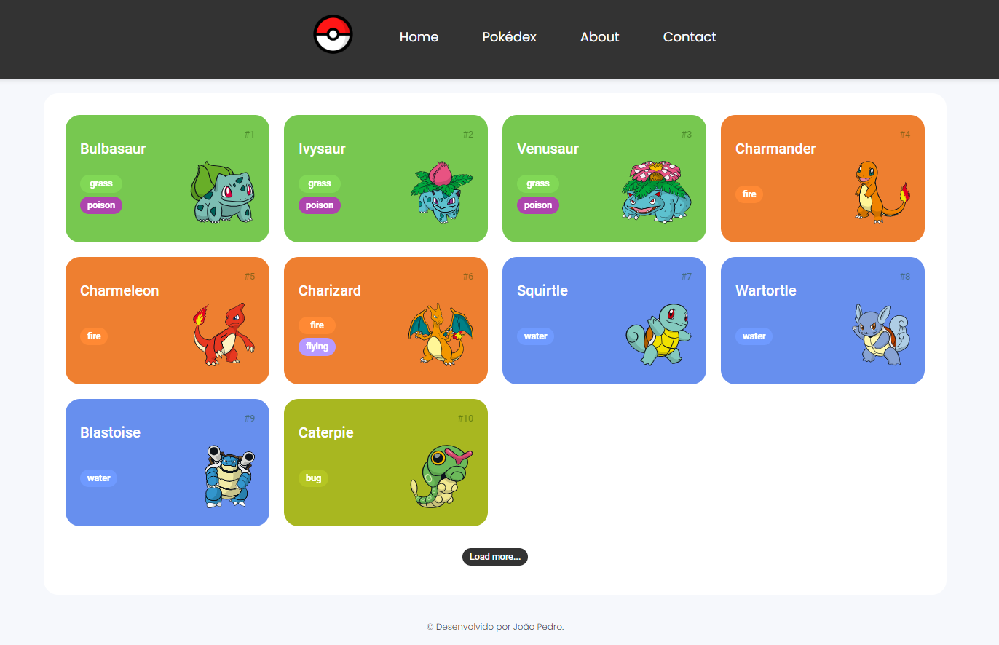

# Pokédex

Este projeto é uma implementação moderna e interativa de uma Pokédex, desenvolvida principalmente para os fãs do universo Pokémon.

## 🚀 Começando

Essas instruções permitirão que você obtenha uma cópia do projeto em operação na sua máquina local para fins de desenvolvimento e teste.


1. Clone este repositório em sua máquina local usando o seguinte comando:

```
git clone https://github.com/seu-usuario/pokedex.git
```

2. Navegue até o diretório do projeto:

```
cd pokedex
```

3. Abra o arquivo index.html em seu navegador preferido para iniciar a Pokedex.




<!--  -->


## ⚙️ Recursos

* Ampla coleção: Explore informações detalhadas sobre centenas de Pokémon, desde os clássicos até os mais recentes.
* Detalhes Abrangentes: Descubra dados essenciais, como tipos, habilidades, evoluções e estatísticas de base de cada Pokémon. Basta clicar no Pokémon.
* Visualizações Atrativas: Visualize belas imagens de cada Pokémon e admire suas características únicas.
* Compatibilidade com Dispositivos Móveis: Acesse a Pokédex de qualquer lugar, em qualquer dispositivo, para que você possa continuar sua jornada Pokémon em movimento.


## 🛠️ Linguagens e Tecnologias

* [HTML](hhttps://developer.mozilla.org/pt-BR/docs/Web/HTML) - Esqueleto das páginas
* [CSS](https://developer.mozilla.org/pt-BR/docs/Web/CSS) - Estilização
* [JavaScript](https://developer.mozilla.org/pt-BR/docs/Web/JavaScript) - Usado para o fetch na API [PokéAPI](https://pokeapi.co/) e para toda a lógica da aplicação 


---
<!-- ## 🎁 Expressões de gratidão -->

* Conte a outras pessoas sobre este projeto 📢;


---
⌨️ com ❤️ por [João Pedro](https://github.com/joaopedronm) 😊